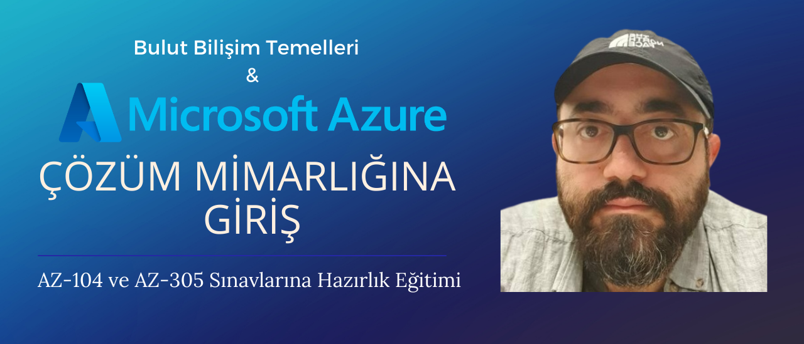

# Bulut Bilişim Temelleri ve Azure Çözüm Mimarlığına Giriş Eğitimi

Ayti.tech olarak temel hedeflerimizden bir tanesini, Türk bilişim sektörü çalışanlarının bilgi seviyesini bu alanda ileri gelen ülkelerdeki bilişim çalışanlarından daha ileriye taşımak olarak belirledik. Bu hedef doğrultusunda Türk bilişim çalışanlarının dil bariyerine takılmadan kendi dillerinde eğitim alabilmeleri için birçok önemli konuda eğitimler hazırlıyoruz. Bu eğitimlerden dördüncüsünü de son dönemlerin yükselen public cloud ortamlarından Azure üstüne hazırladık. Genellikle Azure olarak adlandırılan Microsoft Azure, Microsoft’un temel bulut bilişim platformdur. Microsoft tarafından birçok IAAS, PAAS ve SAAS tabanlı servisin, kullandığın kadar öde de dahil bir ok ödeme seçeneği ile hizmet olarak sunulduğu Azure platformu, public cloud providerlar arasında AWS ve Google Cloud’la birlikte sektörün en önemli oyuncularından biridir. Ve bizler de sizlerin bu alandaki bilgi seviyesini yükseltmeyi amaçlıyoruz.

Toplamda 20 kısım ve 30 saatten fazla içerik olacak şekilde YouTube üstünden ücretsiz yayınlanacak "Bulut Bilişim Temelleri ve Azure Çözüm Mimarlığına Giriş" eğitiminde amacımız, eğitimin adından da anlaşılabileceği üzere sizleri Azure platformu üstünde çözüm mimarlığına hazırlamak. Daha da spesifik olmam gerekirse, eğitim Az-104 ve Az-305 sınavlarını başarıyla geçerek elde edebileceğiniz "Azure Solutions Architect Expert" sertifikasına hazırlık amacı da taşıyor. Bu sınavları geçebilmeniz adına gerekli bilgileri bu eğitim sonunda edinmiş olacaksınız.